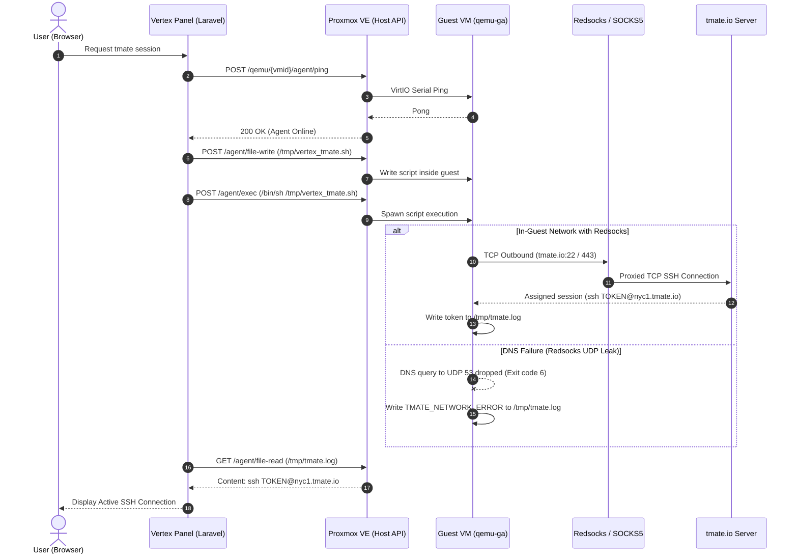

# Vertex Panel & Proxmox: tmate Web Terminal with Redsocks Proxy Architecture & Solutions

---

## 1. Executive Summary & Overview

Vertex Panel provides an on-demand, instant web terminal for Proxmox Virtual Machines using **tmate.io** without requiring the user to open port forwards or configure external IPv4/IPv6 addresses on each VM.

When a user clicks **"Fetch tmate SSH Session"** or **"1-Click Repair"**:
1. **Vertex Panel (Laravel backend)** issues commands to the **Proxmox VE REST API** (`/nodes/{node}/qemu/{vmid}/agent/*`).
2. **Proxmox VE** transmits commands into the Guest VM over the isolated hypervisor VirtIO serial socket (`org.qemu.guest_agent.0`).
3. **QEMU Guest Agent (`qemu-ga`)** inside the VM executes a launcher script that starts the `tmate` daemon.
4. `tmate` connects outbound to `tmate.io` (or a self-hosted tmate-ssh-server) over SSH/TLS.
5. `tmate` outputs an SSH session token (e.g. `ssh ABC123XYZ@nyc1.tmate.io`) to `/tmp/tmate.log`.
6. Vertex Panel reads `/tmp/tmate.log` via the Guest Agent and displays the SSH command in the browser UI.

---

## 2. Why tmate Failed with Redsocks (`CURLE_COULDNT_RESOLVE_HOST` Exit Code 6)

### Root Cause Analysis:
Inside the test VM, `ps aux` showed:
- `qemu-ga` was **100% active and healthy** (PID 634).
- `curl` to `https://github.com/.../tmate.tar.xz` hung indefinitely and `curl https://tmate.io` returned exit code **6** (`CURLE_COULDNT_RESOLVE_HOST`).

### The Redsocks Proxy Mechanism:
**Redsocks** is a transparent TCP proxy redirector that uses `iptables -t nat -A PREROUTING -p tcp -j REDIRECT --to-ports 12345` to route TCP connections through an upstream SOCKS5 / HTTP proxy.

1. **DNS is UDP Port 53 (Redsocks Only Proxies TCP by Default)**:
   - Standard Linux DNS queries (`cat /etc/resolv.conf` -> `nameserver 8.8.8.8`) are sent via **UDP**.
   - Standard `iptables` TCP redirect rules ignore UDP packets.
   - Unless UDP DNS is explicitly converted to TCP (via Redsocks `dnsu2t`, `pdnsd`, `dns2socks`, or a local `coredns`/`systemd-resolved` DNS proxy), the guest VM **cannot resolve domain names** (`github.com`, `tmate.io`).
2. **Curl Hanging without Max Time**:
   - `curl -fsSL --connect-timeout 5` only sets the socket connection timeout. If DNS resolution hangs or the proxy drops the packet silently without sending a TCP RST, `curl` blocks indefinitely.
3. **In-Guest Binary Download Dependency**:
   - Requiring the guest VM to download the `tmate` binary from GitHub over the proxied/restricted guest network introduces a single point of failure.

---

## 3. Complete Diagnostic Flowchart



---

## 4. Proposed Technical Solutions

### Solution 1: Zero-Download Binary Injection (Direct Push from Host/Panel)
Instead of forcing the guest VM to `curl` from GitHub over the proxied guest network:
- Store the static `tmate` x86_64 binary on the **Vertex Panel server** (or Proxmox Host) at `/var/www/vertex/storage/app/bin/tmate` (~3.5 MB).
- When initializing tmate, the backend pushes the binary directly into the guest VM filesystem via `fileWrite('/usr/local/bin/tmate', $binary)` (or base64 chunked via `qemu-ga`).
- **Benefit**: The guest VM **never accesses GitHub or needs package managers (`apt`/`yum`)**. It is instantly ready to run.

---

### Solution 2: Fix DNS Resolution for Redsocks
To allow the guest VM to resolve `tmate.io` and other domains through Redsocks:

#### Option A: Enable Redsocks `dnsu2t` (UDP-to-TCP DNS forwarder)
In `/etc/redsocks.conf` on the router/PVE host:
```ini
dnsu2t {
    local_ip = 0.0.0.0;
    local_port = 10053;
    remote_ip = 8.8.8.8;
    remote_port = 53;
}
```
Add iptables rule on the host/gateway:
```bash
iptables -t nat -A PREROUTING -p udp --dport 53 -j REDIRECT --to-ports 10053
```

#### Option B: Force TCP DNS in Cloud-Init / Guest
Configure `systemd-resolved` in cloud-init user-data to use DNS-over-TCP:
```yaml
write_files:
  - path: /etc/systemd/resolved.conf.d/dns_over_tcp.conf
    content: |
      [Resolve]
      DNS=8.8.8.8#dns.google 1.1.1.1#cloudflare-dns.com
      DNSOverTLS=no
      DNSSEC=no
```

#### Option C: Inject Static `/etc/hosts` for tmate Servers
If DNS is intentionally blocked on private VMs, append static IP mappings directly into the guest `/etc/hosts` via `qemu-ga`:
```bash
# Known tmate.io relay endpoints
143.198.67.135   tmate.io nyc1.tmate.io
159.223.125.10   sfo2.tmate.io
167.99.210.183   ams1.tmate.io
```

---

### Solution 3: In-Guest Script Hardening
The runner script in `TmateSessionService.php` should include:
1. `--max-time 8` on all `curl` calls so network delays fail fast rather than hanging indefinitely.
2. Direct IP fallback or `/etc/hosts` verification before launching `tmate`.
3. Support for `tmate-server-port 443` or websockets if port 22 is blocked by the upstream proxy:
   ```sh
   tmate -S /tmp/tmate.sock set-option -g tmate-server-port 443
   ```

---

## 5. Summary Table of Next Actions

| Component | Issue | Recommended Fix |
| :--- | :--- | :--- |
| **DNS (Redsocks)** | UDP 53 packets dropped by TCP proxy | Enable `dnsu2t` in Redsocks or inject `/etc/hosts` for `tmate.io` |
| **Binary Download** | `curl` hanging on GitHub CDN | Host static binary in Panel and push via `qemu-ga fileWrite` |
| **Script Execution** | No timeout on network calls | Add `--max-time 8` and fail gracefully to UI diagnostics |
| **Console Fallback** | When tmate is unreachable | Direct user to Proxmox Native Web Console (noVNC/xterm.js) |
