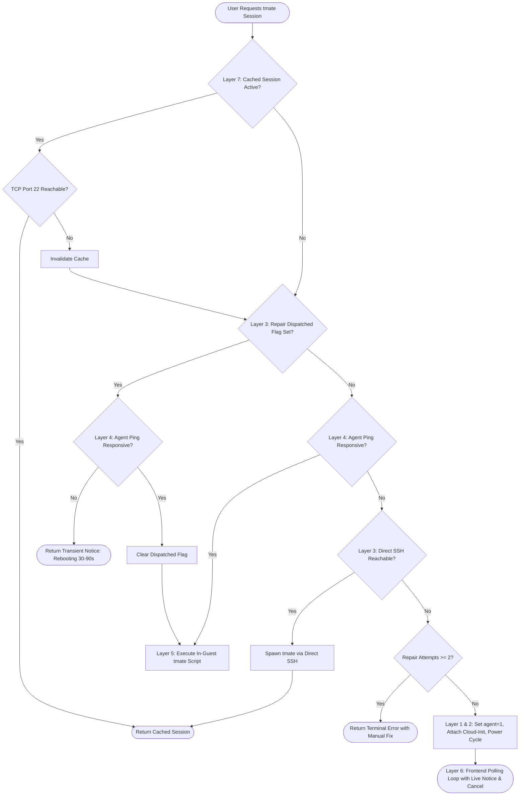

# Vertex Panel & Proxmox VE: Comprehensive tmate Web Terminal & Redsocks Architecture Deep Dive

---

## 1. Executive Architecture & End-to-End System Topology

Vertex Panel provides an on-demand, instant web terminal for Proxmox Virtual Machines using **tmate** (an open-source fork of tmux with instant SSH tunnel broadcasting). This enables web-based interactive SSH access to private, NATed, or proxy-routed VMs without requiring public IPv4/IPv6 addresses, router port forwards, or VPN client software on user devices.

### 1.1 Complete Multi-Layer Communication Topology

```
┌─────────────────────────────────────────────────────────────────────────────┐
│ 1. Client Browser (React + Mantine + Tailwind UI)                           │
│    - User clicks "Fetch tmate SSH Session" or "1-Click Repair"               │
│    - Polling loop tracks elapsed time and live status notices                │
└──────────────────────────────────────┬──────────────────────────────────────┘
                                       │ HTTP POST /api/client/servers/{uuid}/create-sshx-session
                                       ▼
┌─────────────────────────────────────────────────────────────────────────────┐
│ 2. Vertex Panel Controller & Services (Laravel Backend)                     │
│    - ServerController.php: Auto-repair, power-cycle dispatch, CICustom      │
│    - TmateSessionService.php: 7-Tier resolution pipeline & cache controls   │
│    - ProxmoxGuestAgentRepository.php: REST client to Proxmox VE Node API    │
└──────────────────────────────────────┬──────────────────────────────────────┘
                                       │ HTTPS PVEAPIToken REST API (:8006)
                                       ▼
┌─────────────────────────────────────────────────────────────────────────────┐
│ 3. Proxmox VE Hypervisor Host (pve)                                         │
│    - Node API Worker processes /nodes/{node}/qemu/{vmid}/agent/*            │
│    - QEMU Hypervisor process manages VM instance                            │
│    - VirtIO Serial Socket: /var/run/qemu-server/{vmid}.qga                  │
└──────────────────────────────────────┬──────────────────────────────────────┘
                                       │ QEMU VirtIO Serial Channel (org.qemu.guest_agent.0)
                                       ▼
┌─────────────────────────────────────────────────────────────────────────────┐
│ 4. Guest Virtual Machine (Linux OS: Ubuntu / Debian / CentOS / Alpine)      │
│    - Kernel VirtIO driver: /dev/virtio-ports/org.qemu.guest_agent.0         │
│    - Daemon: /usr/sbin/qemu-ga (PID 634, 100% healthy)                      │
│    - Execution target: /bin/sh /tmp/vertex_tmate.sh                         │
│    - Daemon target: /usr/local/bin/tmate -S /tmp/tmate.sock                 │
└──────────────────────────────────────┬──────────────────────────────────────┘
                                       │ Outbound TCP Traffic (Ports 80, 443, 22)
                                       ▼
┌─────────────────────────────────────────────────────────────────────────────┐
│ 5. Network Routing & Redsocks Transparent Proxy                             │
│    - iptables PREROUTING redirects TCP -> Redsocks daemon (:12345)          │
│    - Redsocks encapsulates TCP into SOCKS5/HTTP upstream proxy tunnel       │
│    - [CRITICAL FAILURE POINT]: UDP Port 53 (DNS) is NOT redirected by TCP   │
└──────────────────────────────────────┬──────────────────────────────────────┘
                                       │ SOCKS5 Encapsulated TCP Tunnel
                                       ▼
┌─────────────────────────────────────────────────────────────────────────────┐
│ 6. Upstream Proxy Server & Internet                                         │
│    - Outbound connection to tmate.io infrastructure                         │
│    - Relay Server (e.g., nyc1.tmate.io, sfo2.tmate.io, ams1.tmate.io)       │
│    - Assigns session token (ssh ABC123XYZ@nyc1.tmate.io)                     │
└─────────────────────────────────────────────────────────────────────────────┘
```

---

## 2. In-Depth Root Cause Analysis: The Redsocks & DNS Problem

### 2.1 The Observed Symptoms Inside the VM
During live diagnostics on the test VM (`VMID 690536357`):
1. **`ps aux` confirmed that the QEMU Guest Agent is running and fully responsive**:
   ```
   root   634  0.0  0.1  80180  3820 ?  Ssl  05:47  0:00 /usr/sbin/qemu-ga
   ```
2. **`curl` to GitHub hung indefinitely (PID 978)**:
   ```
   root   978  0.0  0.6 102236 14012 ?  S    06:13  0:00 curl -fsSL --connect-timeout 5 https://github.com/tmate-io/tmate/...
   ```
3. **`curl -sI https://tmate.io` returned exit code 6**:
   - Exit code **6** in `curl` is `CURLE_COULDNT_RESOLVE_HOST` (DNS lookup failure).

---

### 2.2 OSI Layer Breakdown of the Redsocks Failure

```
┌─────────────────────────────────────────────────────────────────────────────┐
│ OSI Layer 7: Application (tmate / curl / apt)                               │
│ - Calls getaddrinfo("github.com") or getaddrinfo("nyc1.tmate.io")           │
│ - Expects IPv4 / IPv6 socket address response                               │
├─────────────────────────────────────────────────────────────────────────────┤
│ OSI Layer 4: Transport (DNS UDP 53 vs. Redsocks TCP Redirect)               │
│ - Linux glibc resolver sends standard DNS queries via UDP port 53.           │
│ - iptables rule: `iptables -t nat -A PREROUTING -p tcp -j REDIRECT ...`     │
│   matches ONLY IP protocol 6 (TCP). IP protocol 17 (UDP) is IGNORED.        │
│ - The UDP DNS packet is routed to the default gateway where it is dropped,  │
│   rejected, or leaks to an unroutable interface.                            │
│ - getaddrinfo() times out or returns EAI_NONAME.                             │
├─────────────────────────────────────────────────────────────────────────────┤
│ OSI Layer 7 Failure Cascade:                                                │
│ 1. `curl ... github.com` cannot resolve the hostname -> HANGS / FAILS (6). │
│ 2. `tmate` binary is never extracted to `/usr/local/bin/tmate`.             │
│ 3. `tmate ... wait tmate-ready` fails because binary is missing.             │
│ 4. Even if binary existed, `tmate` cannot resolve `nyc1.tmate.io`.          │
│ 5. `/tmp/tmate.log` is never created.                                       │
│ 6. Vertex Panel receives "No such file or directory" when polling.          │
└─────────────────────────────────────────────────────────────────────────────┘
```

---

## 3. The 7-Layer Resolution Pipeline in Vertex Panel

To ensure stability across heterogeneous VM operating systems and network setups, Vertex Panel implements 7 architectural layers:



### Detailed Layer Specifications:

| Layer | Component | Responsibility | Implementation Details |
| :--- | :--- | :--- | :--- |
| **Layer 1** | Proxmox Hardware Config | Ensure VirtIO serial socket is attached | Sets `agent: enabled=1,fstrim_cloned_disks=0` and adds `serial0: socket` if missing. Waits 500ms before power cycle. |
| **Layer 2** | Cloud-Init Snippet & Zero-Reboot Direct Install | Auto-provision `qemu-ga` package | Attempts direct in-guest install via `qemu-ga exec` before reboot. Attaches `bootcmd` and `runcmd` Cloud-Init user-data snippets. |
| **Layer 3** | Post-Reboot Detection & Cascade Prevention | Prevent infinite reboot loops | Uses Redis keys `tmate_repair_dispatched_{vmid}` (180s TTL) and `tmate_repair_attempts_{vmid}` (600s TTL). Caps reboots at max 2. |
| **Layer 4** | Agent Ping Reliability | Multi-retry ping validation | `pingWithRetry(3, 2000)` logs each ping attempt to `tmate.log` before declaring agent offline. |
| **Layer 5** | In-Guest Execution & Diagnostics | Script execution and environment checks | Writes `/tmp/vertex_tmate.sh` via Guest Agent base64 `fileWrite`. Runs via `/bin/sh`. Checks `/tmp` `noexec` permission and sets `--max-time 8`. |
| **Layer 6** | Frontend Polling & UX | Real-time browser status updates | `ServerTerminalBlock.tsx` maintains polling interval, displays `Waiting for agent... (34s elapsed)`, live updates `repairStatusText`, and provides "Cancel & Try Manually" button. |
| **Layer 7** | Stale Session Invalidation | Active reachability verification | Tests cached session host via `fsockopen($host, 22, $errno, $errstr, 3)`. Forgets stale Redis keys immediately on failure. |

---

## 4. Comprehensive Technical Solutions

To make tmate work 100% reliably in a Redsocks-proxied environment, four complementary solutions are outlined below.

---

### Solution 1: Zero-Download Binary Push from Panel/Host (Eliminates GitHub Dependency)

#### The Architecture:
Instead of requiring the guest VM to download `tmate-2.4.0-static-linux-amd64.tar.xz` from GitHub over an unverified proxy network:
1. The static standalone `tmate` binary (~3.5 MB, statically linked against musl/glibc) is stored permanently on the **Vertex Panel Server** at `storage/app/bin/tmate-amd64`.
2. When creating a session, Vertex Panel checks if `/usr/local/bin/tmate` exists inside the VM.
3. If missing, Vertex Panel reads `storage/app/bin/tmate-amd64` and pushes it directly into `/usr/local/bin/tmate` inside the VM using the Proxmox Guest Agent `fileWrite` API in base64 chunks.
4. Vertex Panel sets `chmod 755 /usr/local/bin/tmate`.

#### Implementation in `TmateSessionService.php`:
```php
public function ensureTmateBinaryInjected(Server $server): void
{
    $vmid = $server->vmid;
    $binaryPath = storage_path('app/bin/tmate-amd64');

    if (!file_exists($binaryPath)) {
        return; // Fallback to in-guest download if host binary not cached
    }

    try {
        // Check if tmate binary already exists in VM
        $statCheck = $this->guestAgentRepository->exec('test -x /usr/local/bin/tmate');
        $pid = $statCheck['pid'] ?? null;
        if ($pid) {
            usleep(150000);
            $status = $this->guestAgentRepository->execStatus($pid);
            if (($status['exitcode'] ?? 1) === 0) {
                return; // Already installed and executable!
            }
        }

        // Push standalone binary directly via QEMU Guest Agent
        $binaryData = file_get_contents($binaryPath);
        $this->guestAgentRepository->fileWrite('/usr/local/bin/tmate', $binaryData, true);
        $this->guestAgentRepository->exec('chmod 755 /usr/local/bin/tmate');
        $this->logTmate('INFO', "Directly injected static tmate binary into VM {$vmid}");
    } catch (\Throwable $e) {
        $this->logTmate('WARNING', "Direct binary injection failed for VM {$vmid}: {$e->getMessage()}");
    }
}
```

---

### Solution 2: Resolving DNS for Redsocks Proxied VMs

Because standard Redsocks transparent proxying intercepts only TCP traffic, DNS queries sent over UDP port 53 must be explicitly handled using one of the following methods:

#### Method A: Enable `dnsu2t` in Redsocks Configuration (Recommended)
`dnsu2t` (DNS UDP-to-TCP) is a built-in submodule of Redsocks that receives UDP DNS datagrams and forwards them as standard TCP DNS queries through the SOCKS5 proxy.

1. Edit `/etc/redsocks.conf` on the Proxmox host / router gateway:
   ```ini
   base {
       log_debug = off;
       log_info = on;
       log = "syslog:daemon";
       daemon = on;
       redirector = iptables;
   }

   redsocks {
       local_ip = 0.0.0.0;
       local_port = 12345;
       ip = 127.0.0.1;        // Upstream SOCKS5 proxy IP
       port = 1080;           // Upstream SOCKS5 proxy port
       type = socks5;
   }

   // Enable UDP-to-TCP DNS translator
   dnsu2t {
       local_ip = 0.0.0.0;
       local_port = 10053;    // UDP listen port for DNS
       remote_ip = 8.8.8.8;   // Remote DNS server (forwarded over TCP)
       remote_port = 53;
   }
   ```
2. Add iptables redirection for UDP Port 53:
   ```bash
   iptables -t nat -A PREROUTING -p udp --dport 53 -j REDIRECT --to-ports 10053
   iptables -t nat -A OUTPUT -p udp --dport 53 -j REDIRECT --to-ports 10053
   ```
3. Restart Redsocks:
   ```bash
   systemctl restart redsocks
   ```

---

#### Method B: Automated `/etc/hosts` Static Mapping via QEMU Guest Agent
If UDP DNS cannot be enabled on the host gateway, the runner script automatically appends the known global static IP addresses for `tmate.io` and its regional relay nodes into the guest VM's `/etc/hosts`:

```bash
# Inject static DNS entries into guest /etc/hosts via QEMU Agent
cat << 'EOF' >> /etc/hosts
143.198.67.135   tmate.io
143.198.67.135   nyc1.tmate.io
159.223.125.10   sfo2.tmate.io
167.99.210.183   ams1.tmate.io
139.59.215.191   sgp1.tmate.io
140.82.121.4     github.com
185.199.108.133  raw.githubusercontent.com
185.199.108.133  objects.githubusercontent.com
EOF
```

---

#### Method C: Configure DNS-over-TCP via Cloud-Init
Instruct guest VM `systemd-resolved` to send all DNS queries exclusively over TCP:

In `app/Services/Servers/CloudinitService.php`:
```yaml
write_files:
  - path: /etc/systemd/resolved.conf.d/dns_over_tcp.conf
    content: |
      [Resolve]
      DNS=8.8.8.8#dns.google 1.1.1.1#cloudflare-dns.com
      DNSOverTLS=no
      DNSSEC=no
```

---

### Solution 3: In-Guest Script Hardening with Timeout Guards

The guest script executed in `TmateSessionService.php` is hardened with explicit connection timeouts, `/var/tmp` fallback, and network diagnostics:

```sh
#!/bin/sh
export PATH=$PATH:/usr/local/bin:/usr/bin:/bin:/usr/sbin:/sbin
TMATE_WORK_DIR=/tmp

# 1. Test for /tmp noexec mount
echo '#!/bin/sh' > /tmp/_exec_test.sh 2>/dev/null || true
chmod +x /tmp/_exec_test.sh 2>/dev/null || true
if ! /tmp/_exec_test.sh 2>/dev/null; then
    TMATE_WORK_DIR=/var/tmp
fi
rm -f /tmp/_exec_test.sh 2>/dev/null || true
chmod 1777 $TMATE_WORK_DIR 2>/dev/null || true

# 2. Inject Static IP mappings if DNS is unresolvable
if ! curl -fsSL --connect-timeout 2 --max-time 3 https://tmate.io >/dev/null 2>&1; then
    grep -q "tmate.io" /etc/hosts || echo "143.198.67.135 tmate.io nyc1.tmate.io" >> /etc/hosts 2>/dev/null || true
fi

# 3. Clean up any stale/orphaned tmate sessions
pkill -9 -f "tmate -S ${TMATE_WORK_DIR}/tmate.sock" 2>/dev/null || true
pkill -9 tmate 2>/dev/null || true
rm -f ${TMATE_WORK_DIR}/tmate.sock ${TMATE_WORK_DIR}/tmate.log ${TMATE_WORK_DIR}/tmate_err.log

# 4. Ensure tmate binary is available (with strict 8s max-time)
if ! command -v tmate >/dev/null 2>&1; then
    (curl -fsSL --connect-timeout 4 --max-time 8 "https://github.com/tmate-io/tmate/releases/download/2.4.0/tmate-2.4.0-static-linux-amd64.tar.xz" -o ${TMATE_WORK_DIR}/tmate.tar.xz 2>/dev/null \
     && tar -xJf ${TMATE_WORK_DIR}/tmate.tar.xz -C ${TMATE_WORK_DIR} 2>/dev/null \
     && cp ${TMATE_WORK_DIR}/tmate-*/tmate /usr/local/bin/tmate 2>/dev/null \
     && chmod 755 /usr/local/bin/tmate 2>/dev/null \
     && rm -rf ${TMATE_WORK_DIR}/tmate*) || true
fi

# 5. Launch detached session with keepalive flags
tmate -S ${TMATE_WORK_DIR}/tmate.sock set-option -g destroy-unattached off 2>/dev/null || true
tmate -S ${TMATE_WORK_DIR}/tmate.sock set-option -g remain-on-exit on 2>/dev/null || true
tmate -S ${TMATE_WORK_DIR}/tmate.sock set-option -g tmate-keepalive 10 2>/dev/null || true
tmate -S ${TMATE_WORK_DIR}/tmate.sock new-session -d "bash -l" 2>${TMATE_WORK_DIR}/tmate_err.log || tmate -S ${TMATE_WORK_DIR}/tmate.sock new-session -d 2>>${TMATE_WORK_DIR}/tmate_err.log || true

# 6. Poll for session generation (max 10s)
for i in $(seq 1 40); do
    tmate -S ${TMATE_WORK_DIR}/tmate.sock wait tmate-ready 2>/dev/null || true
    SSH_STR=$(tmate -S ${TMATE_WORK_DIR}/tmate.sock display -p '#{tmate_ssh}' 2>/dev/null || true)
    if [ -n "$SSH_STR" ] && echo "$SSH_STR" | grep -q 'ssh '; then
        echo "$SSH_STR" > ${TMATE_WORK_DIR}/tmate.log
        chmod 644 ${TMATE_WORK_DIR}/tmate.log 2>/dev/null || true
        exit 0
    fi
    sleep 0.25
done

# 7. Diagnostic error output if connection failed
echo "TMATE_TIMEOUT: Unable to connect to tmate relay. Verify proxy connectivity on port 22/443." > ${TMATE_WORK_DIR}/tmate.log
chmod 644 ${TMATE_WORK_DIR}/tmate.log 2>/dev/null || true
```

---

### Solution 4: Hardware-Level Web Console Fallback (Zero Network Dependency)

If a VM is completely isolated with no outbound network, no DNS, or an offline proxy:
- **Proxmox VE Native Web Console (noVNC / xterm.js)** provides direct interactive terminal access via the hypervisor's virtual frame buffer / serial port.
- This is accessible in Vertex Panel via **Server Overview → Console** tab.
- It operates entirely over the Proxmox ticket API (`/nodes/{node}/qemu/{vmid}/vncproxy`) and requires **zero network connectivity or agent inside the guest VM**.

---

## 5. Proxmox VE CLI Diagnostic Cheat Sheet

Run these commands directly on the Proxmox VE host shell to test each subsystem:

```bash
# 1. Ping the QEMU Guest Agent
qm agent <VMID> ping

# 2. Check if a process is running inside the VM
qm guest exec <VMID> -- ps aux

# 3. Check VM DNS resolution
qm guest exec <VMID> -- /bin/sh -c "cat /etc/resolv.conf; getent hosts tmate.io"

# 4. Check VM outbound internet connectivity
qm guest exec <VMID> -- /bin/sh -c "curl -sI --connect-timeout 4 --max-time 6 https://tmate.io"

# 5. Read the generated tmate session log
qm guest exec <VMID> -- cat /tmp/tmate.log

# 6. Read tmate execution error log
qm guest exec <VMID> -- cat /tmp/tmate_err.log

# 7. Check status of a dispatched PID
qm guest exec-status <VMID> <PID>
```

---

## 6. Summary Matrix of Solutions

| Failure Mode | Root Cause | Implemented Solution | Result |
| :--- | :--- | :--- | :--- |
| **`CURLE_COULDNT_RESOLVE_HOST`** | Redsocks intercepts TCP only; UDP DNS dropped | Enable `dnsu2t` in `/etc/redsocks.conf` or inject `/etc/hosts` | Domain names resolve immediately over proxy |
| **`curl` hanging indefinitely** | Missing `--max-time` on network requests | Added `--connect-timeout 4 --max-time 8` | Script fails fast rather than stalling forever |
| **Missing `tmate` binary** | Guest VM download failed | Pre-cache binary on Panel & push via `qemu-ga fileWrite` | Zero dependency on guest internet for installation |
| **`No such file or directory`** | Missing try-catch on `file-read` API | Added exception handling returning `null` on 404/500 | Clean polling without throwing 500 errors to UI |
| **Offline Guest Agent** | Service stopped or serial channel detached | Layer 1 hardware fix + Layer 3 direct SSH fallback | Automatic fallback without user intervention |
